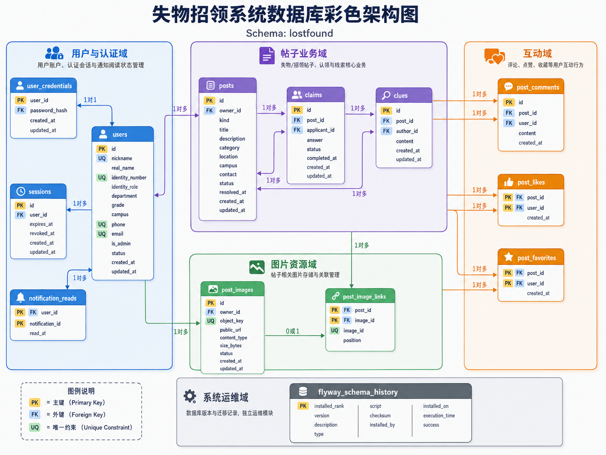

# 校园失物招领

面向高校师生的 HarmonyOS 校园失物招领项目，覆盖失物/寻物信息发布、检索、互动、认领、线索、归还和管理员帖子管理。

当前仓库包含两部分：

- `entry/`：ArkTS + ArkUI 客户端，支持本地演示数据和 Node.js API 联调。
- `server/`、`database/`、`storage-service/`、`deploy/`：Node.js API、MySQL 数据库脚本、图片存储服务和 Docker 配置。

客户端不会直接连接 MySQL。生产或多人环境应通过 HTTPS API 访问后端；本地演示模式则使用 Preferences 保存账号、会话和内容快照。

## 当前交付状态

| 模块 | 当前状态 |
| --- | --- |
| HarmonyOS 客户端 UI | 已实现，包含普通用户和管理员工作台 |
| 本地演示账号与内容 | 已实现，使用 Preferences 持久化 |
| Node.js API | 已实现，使用 Express、Knex 和 MySQL |
| 图片上传 | 已实现，支持 API 本地存储或独立图片存储服务 |
| 认证 | 后端提供密码登录；客户端保留本地验证码、注册和账号管理演示流程 |
| 数据库 | 提供 SQL 初始化脚本和 Knex migrations |
| 自动化测试 | 客户端 Hypium 测试、Node.js API 测试均已提供 |
| 发布签名 | 未配置，不生成可直接发布的 HAP |

## 功能概览

### 普通用户

- 手机号或学校邮箱注册、密码登录和演示验证码登录。
- 学生、教师、教职工身份信息维护。
- 发布失物/寻物动态，按关键词、类型、分类、校区和状态查看信息。
- 查看详情、点赞、收藏、评论、提交认领申请和寻物线索。
- 发布者审核认领申请并确认归还。
- 查看我的发布、认领/线索、收藏和消息通知。
- 修改资料、密码、绑定手机号/邮箱、退出和注销账号。

### 管理员

- 进入独立管理员工作台。
- 按身份、院系/部门和账号状态筛选用户。
- 冻结、解冻、注销账号和变更管理员权限。
- 查看和管理帖子；删除操作为可恢复的软删除。
- 高影响操作需要二次确认，管理员不能操作自己。

界面中的“失物”表示拾到物品后发布的招领信息；“寻物”表示失主发布的寻找信息。代码中分别使用 `LOST_NOTICE` 和 `SEARCH_NOTICE`。

## 技术栈

| 项目 | 技术 |
| --- | --- |
| 客户端 | HarmonyOS、ArkTS、ArkUI、Stage 模型 |
| SDK | HarmonyOS 6.1.1 / API 24 |
| 客户端存储 | Preferences |
| 客户端测试 | Hypium 1.0.25 |
| API | Node.js 22、Express 5、Knex、MySQL |
| API 测试 | Node.js Test Runner、Supertest |
| 图片服务 | Node.js、Express、Multer、Docker |

建议使用与工程 SDK 版本匹配的 DevEco Studio 打开项目。

## 项目结构

```text
LostAndFound/
├── AppScope/                         # 应用级配置和资源
├── entry/                            # HarmonyOS 客户端
│   └── src/
│       ├── main/ets/pages/           # 页面与业务 UI
│       ├── main/ets/stores/          # AuthStore、AppStore
│       ├── main/ets/services/        # 本地服务和 API Repository
│       ├── main/ets/models/          # 账号、帖子和业务模型
│       └── test/                     # ArkTS 本地单元测试
├── server/                           # Node.js API
│   ├── src/auth/                     # 认证与权限
│   ├── src/posts/                    # 帖子与管理员帖子管理
│   ├── src/claims/                   # 认领与线索
│   ├── src/comments/                 # 评论
│   ├── src/files/                    # 图片上传与存储适配
│   ├── src/notifications/            # 消息通知
│   ├── src/db/migrations/            # Knex 数据库迁移
│   └── test/                         # API 测试
├── storage-service/                  # 独立图片存储服务
├── database/                         # MySQL 初始化与升级 SQL
├── deploy/                           # Docker Compose 和 Nginx 配置
├── TESTING.md                        # 客户端手工验收与自动化测试流程
├── build-profile.json5               # HarmonyOS 产品和 SDK 配置
└── oh-package.json5                  # HarmonyOS 依赖声明
```

## 客户端运行

1. 使用 DevEco Studio 打开仓库根目录。
2. 等待 Hvigor 同步完成，并确认已安装 HarmonyOS 6.1.1 / API 24 SDK。
3. 选择 `entry` 模块、`default` 产品，连接 HarmonyOS 模拟器或真机后运行。
4. 项目没有配置签名；如需安装到真机，请在 DevEco Studio 中配置个人调试签名，不要提交签名文件或私钥。

客户端已声明 `ohos.permission.INTERNET`。API 地址目前写在 `entry/src/main/ets/services/api/ApiClient.ets` 的 `API_BASE_URL` 常量中。接入其他电脑或设备前，应将其改为客户端可访问的后端地址。

### 本地演示账号

| 类型 | 账号 | 密码 |
| --- | --- | --- |
| 学生 | `13800000001` 或 `lin@campus.edu.cn` | `Campus123` |
| 管理员 | `admin@campus.edu.cn` | `Admin1234` |

验证码不会发送到真实手机或邮箱。点击“获取演示验证码”后，验证码会直接显示在页面中。首次启动会创建预置账号；如需恢复初始数据，可在系统设置中清除应用数据。

客户端当前采用混合模式：

- 密码登录会优先请求 `ApiClient` 配置的后端地址。
- 验证码登录、注册、找回密码、资料维护等演示流程仍由本地 `MockAuthService` 处理。
- 使用后端会话时，帖子、评论、认领、线索、互动和通知通过 API 读取或写入。
- 后端不可用时，客户端仍可使用本地内容快照完成演示流程，但密码登录不会自动把后端登录错误转换为本地密码登录。

## Node.js API

### 安装依赖与测试

在仓库根目录 PowerShell 中执行：

```powershell
npm.cmd --prefix .\server ci
npm.cmd --prefix .\server test
```

API 测试不要求连接真实 MySQL，覆盖健康检查、请求错误、数据库字符集、通知状态和远程图片存储错误处理。

### 本地启动 API

API 至少需要 `DATABASE_URL` 和长度不少于 32 个字符的 `APP_JWT_SECRET`。下面示例使用 API 本地保存图片：

```powershell
$env:DATABASE_URL = 'mysql://lostfound:<MYSQL_PASSWORD>@127.0.0.1:3308/lostfound'
$env:APP_JWT_SECRET = '<生成一个至少32字符的随机密钥>'
$env:APP_STORAGE_MODE = 'local'
$env:APP_STORAGE_ROOT = '.\server\storage\uploads'
$env:APP_PUBLIC_UPLOAD_PREFIX = '/uploads'
$env:PORT = '3000'
npm.cmd --prefix .\server start
```

健康检查：

```powershell
curl.exe http://127.0.0.1:3000/health/live
curl.exe http://127.0.0.1:3000/health/ready
```

`/health/live` 只检查进程；`/health/ready` 会查询 MySQL。修改 `server/` 后应先停止旧进程，再重新启动 API。

### Windows API + Linux 图片服务联调

当前仓库支持将业务 API 和 MySQL 放在 Windows 主机，将图片服务放在 VMware Linux。Linux 图片服务使用 HMAC 请求签名，Windows API 与图片服务必须配置相同的共享密钥。

在 Linux 虚拟机中启动图片服务：

```bash
cp storage-service/.env.example /secure/path/storage.env
# 将 STORAGE_SHARED_SECRET 修改为至少 32 个字符的随机值
docker compose --env-file /secure/path/storage.env \
  -f deploy/storage-compose.yaml up -d --build
curl http://192.168.137.10:8081/health/live
```

在 Windows 主机启动 API：

```powershell
$env:DATABASE_URL = 'mysql://lostfound:<MYSQL_PASSWORD>@127.0.0.1:3308/lostfound'
$env:APP_JWT_SECRET = '<生成一个至少32字符的随机密钥>'
$env:APP_STORAGE_MODE = 'remote'
$env:APP_STORAGE_BASE_URL = 'http://192.168.137.10:8081'
$env:APP_STORAGE_SHARED_SECRET = '<与Linux STORAGE_SHARED_SECRET相同>'
$env:APP_PUBLIC_BASE_URL = 'http://<Windows主机可访问地址>:3000'
npm.cmd --prefix .\server start
```

图片链路为：客户端上传 → API `/api/v1/files/images` → 图片服务保存文件 → MySQL 保存对象键和公开 URL → 帖子绑定图片 ID。客户端只访问业务 API，不直接访问图片服务的内部签名接口。

### Docker 配置说明

- `deploy/compose.yaml` 启动 API、Nginx 和本地 Docker 图片卷，Nginx 暴露 `8080`；它不创建 MySQL 容器，也不会自动执行数据库迁移。
- `deploy/storage-compose.yaml` 只启动独立图片存储服务，默认监听 `192.168.137.10:8081`。
- `deploy/.env.example` 和 `storage-service/.env.example` 只包含配置模板，实际环境文件应放在仓库外。

使用 API + Nginx 配置时：

```bash
docker compose --env-file /secure/path/lostfound.env \
  -f deploy/compose.yaml up -d --build
curl http://localhost:8080/health/live
curl http://localhost:8080/health/ready
```

注意：当前 `deploy/compose.yaml` 的 API 容器使用本地图片存储配置；如果要让该 Compose 服务使用 `storage-service`，需要在部署环境中补充并传入 `APP_STORAGE_MODE`、`APP_STORAGE_BASE_URL`、`APP_STORAGE_SHARED_SECRET` 等变量。

## 数据库初始化与迁移

### SQL 脚本

当前 Windows MySQL 联调使用 `database/` 下的脚本：

| 文件 | 用途 |
| --- | --- |
| `01_schema.sql` | 创建基础表 |
| `02_seed_dev.sql` | 开发演示账号和数据，仅限开发环境 |
| `03_migration_utf8mb4.sql` | 将已有表转换为 `utf8mb4` |
| `04_interactions.sql` | 管理员权限、帖子软删除、点赞和收藏 |
| `05_comments.sql` | 持久化评论表 |
| `06_notification_reads.sql` | 持久化消息已读状态 |

首次初始化示例：

```bash
mysql -h 127.0.0.1 -P 3308 -u lostfound -p < database/01_schema.sql
mysql -h 127.0.0.1 -P 3308 -u lostfound -p < database/02_seed_dev.sql
```

已有数据库升级时，根据实际版本按顺序执行对应升级脚本；不要在生产环境导入 `02_seed_dev.sql`。

### SQL 数据库结构图

下图展示 `lostfound` 数据库中用户认证、帖子业务、互动、图片资源和迁移记录之间的主要关系：



### Knex migrations

后端也提供 `server/src/db/migrations/` 和对应 npm 命令：

```powershell
npm.cmd --prefix .\server run migrate
npm.cmd --prefix .\server run migrate:rollback
```

SQL 脚本和 Knex migrations 是两套数据库管理入口。针对同一个数据库应先确认当前表结构和迁移记录，不要未经检查地重复执行两套初始化流程。

## API 目录

API 统一使用 `/api/v1` 前缀，并返回如下包装结构：

```json
{
  "code": "OK",
  "message": "success",
  "data": {},
  "requestId": "..."
}
```

主要接口如下：

| 能力 | 接口 |
| --- | --- |
| 健康检查 | `GET /health/live`、`GET /health/ready` |
| 密码登录 | `POST /api/v1/auth/login/password` |
| 公共帖子 | `GET /api/v1/posts/public` |
| 帖子 | `GET/POST /api/v1/posts`、`GET /api/v1/posts/:id` |
| 点赞/收藏 | `PUT/DELETE /api/v1/posts/:id/like`、`PUT/DELETE /api/v1/posts/:id/favorite` |
| 图片 | `POST /api/v1/files/images`、`DELETE /api/v1/files/images/:id` |
| 评论 | `GET/POST /api/v1/posts/:id/comments` |
| 认领/线索 | `GET/POST /api/v1/posts/:id/claims`、`GET/POST /api/v1/posts/:id/clues` |
| 归还 | `PATCH /api/v1/claims/:id/return` |
| 通知 | `GET /api/v1/notifications`、`PUT /api/v1/notifications/read` |
| 管理员帖子 | `GET /api/v1/admin/posts`、`DELETE /api/v1/admin/posts/:id`、`PUT /api/v1/admin/posts/:id/restore` |

除登录和公共帖子接口外，其余接口使用 `Authorization: Bearer <access-token>`。权限必须由服务端校验，客户端传入的用户 ID、角色和管理员字段不能作为授权依据。

## 测试与验收

### HarmonyOS 编译和测试

完整的 ArkTS 编译、Hypium 测试、启动白屏回归、账号隔离、认领流程和管理员验收步骤见 [TESTING.md](TESTING.md)。常用命令：

```powershell
$env:DEVECO_SDK_HOME = 'C:\Program Files\Huawei\DevEco Studio\sdk'
$env:Path = 'C:\Program Files\Huawei\DevEco Studio\tools\node;' + $env:Path
& 'C:\Program Files\Huawei\DevEco Studio\tools\hvigor\bin\hvigorw.bat' `
  --mode module -p product=default -p module=entry@default -p buildMode=debug `
  'default@CompileArkTS' --no-daemon --no-incremental
```

执行 Hypium 测试时，将最后的任务替换为 `test`。

### 测试注意事项

- 设备验收需要连接 HarmonyOS 模拟器或真机。
- 验证跨重启持久化时，应保留应用数据，不要使用会卸载应用的运行方式重新安装。
- 项目未配置签名，不以生成 HAP 作为本次交付验证项。

## 安全与交付注意事项

- 不要提交 `.env`、数据库密码、JWT 密钥、图片服务共享密钥、TLS 私钥或签名文件。
- 生产环境必须使用随机密钥、HTTPS、服务端密码哈希和最小权限数据库账号。
- `02_seed_dev.sql` 中的演示账号只适用于开发环境，部署前必须删除或修改。
- 图片服务仅允许 JPEG、PNG、WebP，单文件大小上限为 10 MB。
- 账号注销、帖子删除和图片清理涉及数据一致性；升级或回滚前应分别备份 MySQL 数据和图片卷。
- 当前客户端仍包含本地演示认证与默认 API 地址，正式多人部署前应统一认证、配置注入和环境管理方案。

## 参考文档

### 项目文档

- [测试与验收流程](TESTING.md)：ArkTS 编译、Hypium 测试、设备验收和核心业务回归步骤。
- [数据库初始化脚本](database/)：MySQL 基础表、开发种子数据和增量升级脚本。
- [后端数据库迁移](server/src/db/migrations/)：Node.js API 使用的 Knex migrations。
- [部署配置](deploy/)：API、Nginx 和独立图片存储服务的 Docker Compose 配置。

### HarmonyOS 官方文档

- [HarmonyOS 文档中心](https://developer.huawei.com/consumer/cn/doc/?catalogVersion=V2)：开发指南、API 参考、版本说明和示例代码。
- [HarmonyOS 快速入门](https://developer.huawei.com/consumer/cn/doc/harmonyos-guides/quick-start)：ArkTS 应用创建、构建和运行基础流程。
- [ArkTS 资源与指南](https://developer.huawei.com/consumer/cn/arkts/resources/)：ArkTS 语言和工程实践。
- [ArkUI 开发入门](https://developer.huawei.com/consumer/cn/arkui/devstart/)：声明式 UI、页面导航和响应式界面开发。
- [Preferences API 参考](https://developer.huawei.com/consumer/cn/doc/harmonyos-references-V5/js-apis-data-preferences-V5)：客户端本地偏好数据读写。
- [Network Kit](https://developer.huawei.com/consumer/cn/hms/huawei-networkkit)：网络访问、文件上传和下载能力。
- [Asset Store Kit](https://developer.huawei.com/consumer/cn/doc/harmonyos-guides-V14/asset-store-kit-overview-V14)：Token 等短敏感数据的安全存储参考。

### 后端依赖文档

- [Node.js 22 文档](https://nodejs.org/docs/latest-v22.x/api/)：运行时、HTTP 和测试相关 API。
- [Express 文档](https://expressjs.com/)：API 路由和中间件。
- [Knex 文档](https://knexjs.org/guide/)：数据库连接和 migrations。
- [Docker Compose 文档](https://docs.docker.com/compose/)：API 和图片存储服务部署。

## 开源协议

本项目采用 MIT License 开源协议。

详细内容请查看 [LICENSE](LICENSE) 文件。
